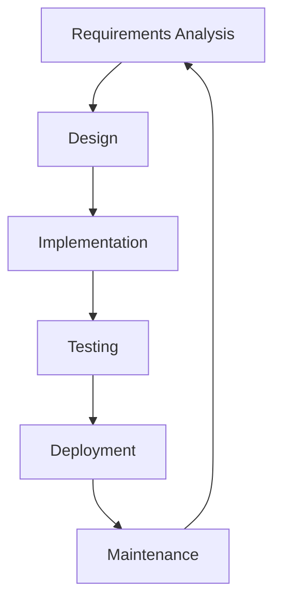

# Obsidian GitHub Copilot Plugin


Use **GitHub Copilot** in the Obsidian editor. This plugin is a bridge between the Obsidian editor and the GitHub Copilot service.

- 🤖 Get inline suggestion as you type using GitHub Copilot service
- 💬 Use the GitHub Copilot Chat service to ask questions about your notes

> [!WARNING]  
> As I'm now using other services for AI completion and Chat in my IDE and dev workflow, I don't have a Copilot subscription anymore. <br>
> I won't be able to develop new features and fix bug that requires the copilot subscription.<br>
>
> But if you want to contribute I would be delighted to accept any help. 

## 🗒️ Requirements

- A GitHub Copilot subscription (https://copilot.github.com/)
- Network connection to send and receive data from the GitHub Copilot service

## ⚙️ Installation

1. Install the plugin via the Obsidian community plugins browser.
2. Activate the plugin in the settings. Make sure to configure any necessary options.

## 🤖 GitHub Copilot Inline


### Requirements

- Node.js 20 or later

### Installation

1. Once installed, go to the plugin settings and enter the path to the Node +20 binary. You can find it by running `which node` in your terminal.
2. Either
   1. A modal will appear asking you to sign in to Copilot. Follow the instructions to sign in.
   2. Or, you will receive a notice saying that Copilot is ready to use. (This will happen if you have already signed in to Copilot in the past in IDEs)

> [!NOTE]  
> If you install the plugin by cloning it or downloading the release files from GitHub, you will need to name the plugin folder `github-copilot` for the plugin to work.


### Usage

1. Open a note in Obsidian. 
2. Write something in the editor.
3. After a small pause, Copilot will suggest completions for your text.
4. Press `Tab` to accept a suggestion or `Esc` to dismiss it.

### Features

- [x] Use GitHub Copilot in the Obsidian editor
- [x] Configure the suggestion generation delay
- [x] Configure your bindings to accept, dismiss, trigger or partially accept suggestions
- [x] Configure if you want to see automatic suggestions or only trigger them manually
- [x] Configure if you want to see suggestion only in code blocks or in the whole note 
- [x] Exclude folders and files from the suggestion generation 

### Known issues

- If you installed Obsidian with Flatpak, you might need to use NVM to handle Node.js versions as the default binary path is not accessible in the Flatpak sandbox. See [this issue](https://github.com/Pierrad/obsidian-github-copilot/issues/6) for more information.
- "Tab" completion can be buggy in some cases (e.g. in bullet points in LateX Math mode for example). It depends on plugin priority over the keybindings. See [this issue](https://github.com/Pierrad/obsidian-github-copilot/issues/38) for more information. 


## 💬 GitHub Copilot Chat

https://github.com/user-attachments/assets/89089920-45de-47c3-80b1-f2d58d1ba55e

### Installation

- Once installed, you can find the GitHub Copilot Chat in the right sidebar of Obsidian.
- It should ask you to sign in to GitHub Copilot. Follow the instructions to sign in.

### Usage

- Open the GitHub Copilot Chat in the right sidebar.
- Choose a model to use (e.g. `gpt-4` or `claude 3.7`).
- Ask a question and like a note like you would do in the obsidian editor (e.g. `Can you summarize this note [[my note]]?`).

### Features

- [x] Use GitHub Copilot Chat in the Obsidian editor
- [x] Choose the model to use between all models available in the GitHub Copilot Chat service
- [x] Implement a chat history
- [x] Link notes with [[double bracket syntax]] in the chat
- [x] Configure a custom prompt as a system message in the settings
- [x] Let the user choose the default behavior of the enter key (send message or add a new line)
- [x] **Mermaid diagram support** - Render Mermaid diagrams in chat responses
- [ ] Stream the response from the API
  - Waiting for requestUrl to implement Streaming : https://forum.obsidian.md/t/support-streaming-the-request-and-requesturl-response-body/87381

### Mermaid Diagrams

The chat supports rendering Mermaid diagrams when GitHub Copilot responds with Mermaid code blocks. Simply ask Copilot to create a diagram and it will render visually in the chat.

**Example usage:**
```
You: Can you create a flowchart showing the software development lifecycle?

Copilot: Here's a flowchart of the software development lifecycle:



**Supported diagram types:**
- Flowcharts
- Sequence diagrams
- Class diagrams
- State diagrams
- Gantt charts
- Pie charts
- And more...

The diagrams automatically adapt to your Obsidian theme (light/dark mode) and are fully integrated into the chat interface.
